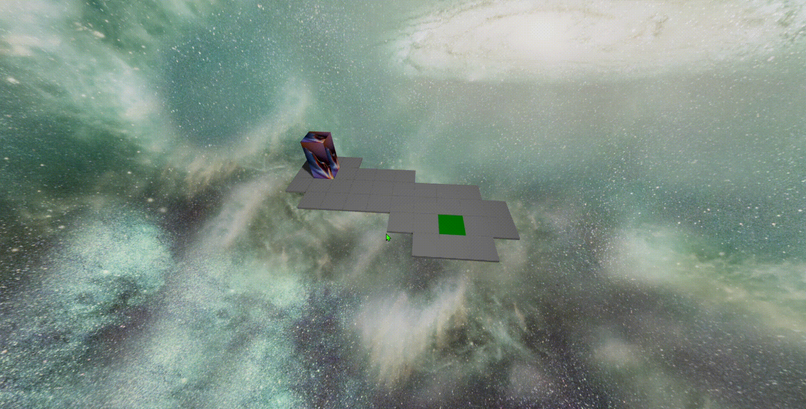

# Introduction

### This repo is for the 3rd semester Web Tech project.

It is a website that allows you to play a game called Bloxorz. Bloxorz is a game where you manipulate a cuboidal block (1x2x1 dimensions) through a set of platforms and navigate to the exit without falling off the edge. It has a leaderboard to keep track of the scores of every user.
## Gameplay

 

# Website Components

* **Homepage**: The main page containing buttons leading to other pages. 
* **Login**: The page containing the user login/register section.
* **Game**: The actual bloxorz game.
* **Leaderboard**: The leaderboard containing the moves of every user.
* **Instruction**: The page containing the instructions regarding how to play the game.
* **Credits**: The page containing the information of the project contributors.

# Prerequisites

### Primary dependencies

 
 

 

* [**MongoDB**](https://www.mongodb.com) (mongoose v6.x.x or higher)

* [**Express**](https://expressjs.com) (v4.x.x or higher)

* [**React**](https://reactjs.org) (v17.x.x or higher)

* [**Node**](https://nodejs.org/en/) (v16.x.x or higher)

Other dependencies include [three.js](https://threejs.org), [@react-three/fiber](https://github.com/pmndrs/react-three-fiber), [react-spring](https://react-spring.io), [react-router-dom](https://reactrouter.com).

The remaining dependencies used can be checked in [package.json](package.json).

# Instructions

Clone the repository.

Run the following commands in the terminal:

`cd bloxorzjs`

`npm i`

To run the application, type: `npm start` in the terminal.
The application will be visible in [http://localhost:3000](http://localhost:3000) on your browser. 

To connect to a database, create a [.env](https://nodejs.dev/learn/how-to-read-environment-variables-from-nodejs) file in the main directory containing a variable: SRV = "[Your [mongoDB URI](https://docs.mongodb.com/manual/reference/connection-string/)]"

# Contributors

* ### [Prajay V K](https://github.com/PrajayVK)
* ### [Pranav K R](https://github.com/ProBrother7)
* ### [Rahul Samal](https://github.com/Omicron02)
